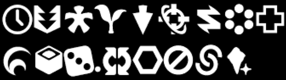
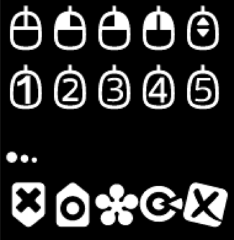

# XIV AXIS Font Unicode Block 

Updated Patch 7.1

## Private Use Area `E000`-`F8FF` (174 glyphs)



> `あ` `ア` `Ａ` `_ｱ` `_A` `가` `中` `英`
> 
> For IME use. Negative Boxed.



> `m` `分`



> `【` `】`





> 



> 
>
> `Gil`



> `○` `□` `✕` `△` `+`









> 



> `0` `1` `2` `3` `4` `5` `6` `7` `8` `9`



> `Lv` `ST` `Nv`



> `AM` `PM`



> 



> `?`
>
> Negative Boxed Question Mark.




> `A` `B` `C` `D` `E` `F` `G` `H` `I` `J` `K` `L` `M`
>
> `N` `O` `P` `Q` `R` `S` `T` `U` `V` `W` `X` `Y` `Z`
>
> Negative Boxed Latin Capital Letters.






> `0` `1` `2` `3` `4` `5` `6` `7` `8` `9`
>
> `10` `11` `12` `13` `14` `15` `16` `17` `18` `19`
>
> `20` `21` `22` `23` `24` `25` `26` `27` `28` `29`
>
> `30` `31`
>
> Negative Boxed Numbers.



> `+` `E`
>
> Negative Boxed.



> `0` `1` `2` `3` `4` `5` `6` `7` `8` `9` `∞`
>
> Negative Hexagoned Numbers/Signs.



> 
>
> Link Sign to Map.



> 



> `🟊` `Ⅰ` `Ⅱ` `Ⅲ` `Ⅳ` `Ⅴ` `Ⅵ`
>
> Negative Boxed Signs used in Bozja enemies/boss name plate.



> `LT` `ST` `ET`



> `OZ` `SZ` `EZ`



> `HL` `HS` `HE`



> `本` `服` `艾`



> `0` `1` `2` `3` `4` `5` `6` `7` `8` `9`
>
> Boxed Numbers used in party list.
> * New in Patch 7.1.

## Reference
[Font Mod Generator for FFXIV](https://github.com/Soreepeong/FFXIV-FontChanger)
by [Soreepeong](https://github.com/Soreepeong)